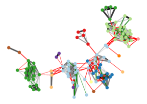

# Weighted F-free Edge Editing




> *Example of a protein-protein interaction network which is edited to be (C4, P4)-free. The connected components can be
> interpreted as clusters of the original graph.*

This is the source code for a bachelor thesis regarding the Weighted F-free Edge Editing Problem [[PDF]](https://i11www.iti.kit.edu/_media/teaching/theses/ba-spinner-19.pdf).
We implement exact FPT and ILP algorithms. The FPT algorithm is based on work from 
[[GHS+20]](https://arxiv.org/abs/2003.14317) for (unweighted) F-free Edge Editing.

The code was further developed after the thesis was submitted. The project state at the time of submission can be found
in commit [`fa537279`](https://github.com/jonasspinner/weighted-f-free-edge-editing/tree/fa537279e4dd750b91c5ceece56778981b5d60d6).


## Setup and Installation

### Dependencies

The required dependencies are [Boost](https://www.boost.org/) and [YAML CPP](https://github.com/jbeder/yaml-cpp/).
To clone submodules and install dependencies execute the following commands:
```bash
git submodule update --init --recursive
sudo apt install libboost-all-dev libyaml-cpp-dev
```

#### Optional Dependencies

[Gurobi](https://www.gurobi.com/) is a commercial LP-Solver. It is used for an [ILP algorithm](src/solvers/ILPSolver.h) as an alternative solver and
for [Linear Program Relaxation](src/lower_bound/LPRelaxation.h) to compute lower bounds for the
[FPT algorithm](src/Editor.h). You can get Gurobi [here](https://www.gurobi.com/de/downloads/).

[ILS MWIS](https://sites.google.com/site/nogueirabruno/software) is a Maximum Weight Independet Set (MWIS) solver.
It is used for computing a subgraph packing to get lower bounds for the FPT algorithm. It can be downloaded by
executing `extern/ils_mwis/get.sh`.

### Datasets

The datasets used are protein-protein interaction matrices derived from the
[`biological` dataset](https://bio.informatik.uni-jena.de/data/#cluster_editing_data). The instances must follow the [METIS](https://people.sc.fsu.edu/~jburkardt/data/metis_graph/metis_graph.html) data format for graphs. The datasets can be downloaded and transformed using [snakemake](https://snakemake.readthedocs.io/en/stable/).
```bash
snakemake -j all \
    data/bio \
    data/bio-C4P4-subset \
    data/bio-subset-A \
    data/bio-subset-B \
    data/bio-unweighted
```

Alternatively, the required scripts can be executed by hand.
```bash
python3 scripts/download_dataset.py --dir data/bio --config data/bio.yaml --biological --max-size 1000
python3 scripts/generate_dataset_subset.py data/bio-C4P4-subset.yaml
...
```

### Building

The project uses [CMake](https://cmake.org/) for building.

```bash
mkdir build && cd build
cmake .. -DCMAKE_BUILD_TYPE=Release
make fpt
```

To try out the algorithm you can use this example.
```bash
build/fpt --multiplier 100 --F C4P4 \
    --input data/bio/bio-nr-3-size-16.graph \
    --lower-bound SortedGreedy \
    --selector MostAdjacentSubgraphs \
    --search-strategy Fixed --k 500
```

## How to cite

```
Jonas Spinner. Weighted F-free Edge Editing. Bachelor thesis, Karlsruhe, 2019.
```


```bibtex
@thesis{Spinner2019,
    title = {{Weighted} {F}-free {Edge} {Editing}},
    language = {en},
    school = {Karlsruhe Institute of Technology},
    author = {Spinner, Jonas},
    date = {2019-11-29},
    type={Bachelor thesis},
    url={https://i11www.iti.kit.edu/_media/teaching/theses/ba-spinner-19.pdf}
}
```

## License

This project is licensed under the [MIT license](LICENSE). The licenses of external sources can be found in their
respective directories.
